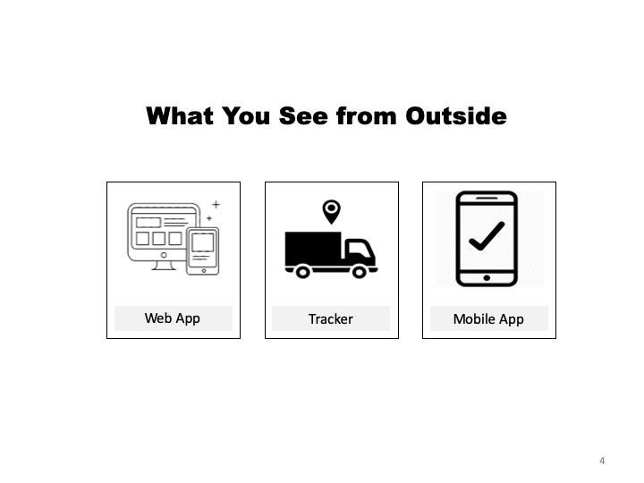
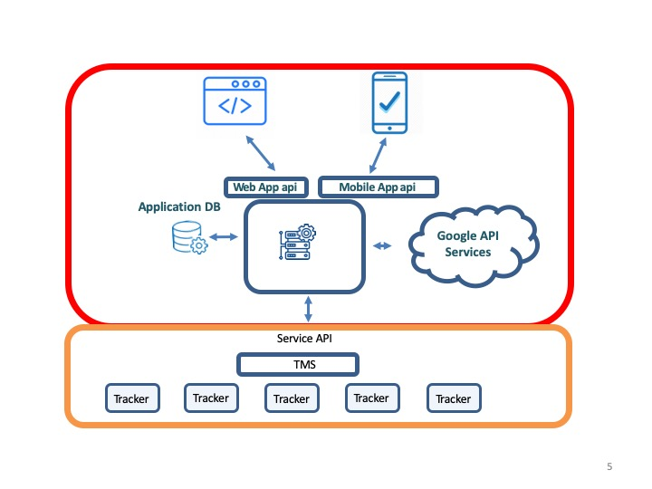
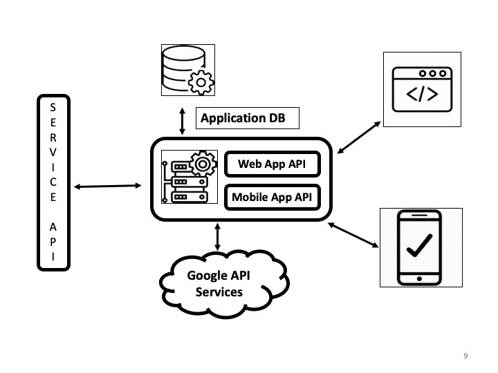
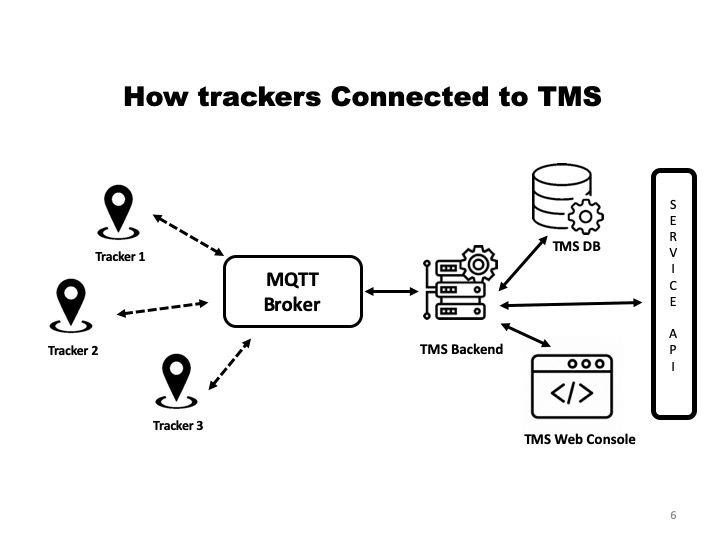
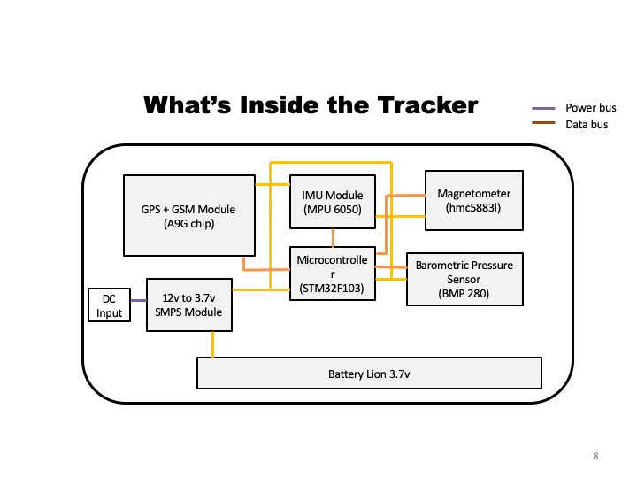

[comment]: # "This is the standard layout for the project, but you can clean this and use your own template"

# Safer Travel Utility (SaVy)

---

## Team
-  E/15/363, THILAKARATHNE E.R.R.I., [ireshe@outlook.com](mailto:ireshe@outlook.com)
-  E/15/048, CHANDRASIRI S.A.G.L., [laksaragayal1996@gmail.com](mailto:laksaragayal1996@gmail.com)
-  E/15/043, BHAGYA T.P.Y., [yasirubhagya@eng.pdn.ac.lk](mailto:yasirubhagya@eng.pdn.ac.lk)

## Table of Contents
1. [Introduction](#introduction)
2. [Solution Architecture](#solution-architecture )
3. [Hardware & Software Designs](#hardware-and-software-designs)
4. [Links](#links)

---

## Introduction

According to the Wikipedia once CTB was the largest omnibus company in the world. Currently CTB has more than 6000+ buses operating in the road which is the same number of private buses operating in Sri Lanka. Sri Lanka has the second highest road density in Asia in 2011 (173.8 km/km2). Although there are so many roads and buses in the road still people don’t like to use public transportation very much. we feel, it’s because public transportation is very unpredictable and sometimes, we have to wait hours and hours in bus stations waiting for a bus. It’s so hard to find the right bus for the right location if you don’t know the right route number. So, we feel this all happens due to the inefficiency and mismanagement of resources. So, our plan is to make a tracker management system for bus owners. So CTB and private bus owners can install our trackers in their buses to track their buses current locations, distance bus traveled for a specific time period, take rough idea of fuel required for the buses and check whether there’s any difference between consumed fuel and predicted fuel usages. So, by providing this information to owners our goal is to install our system in most of the buses that we can. Afterwards we are going to use those real time generated date from our trackers to provide commute assistance to general public. So general public can easily navigate using our app. They don’t have to wait in bus stands for the buses. Because now they know where their bus is, thanks to our app. So, using the real time data set we can provide push notifications to users about the right bus and where it is, ETA (Estimate time of Arrival) for their journeys. So, they don’t have to waste their valuable time looking for buses. And we believe this will be useful for the CTB and private bus owners to manage their fleets as well. They can find the hotspots in transportation and provide more buses to those places. And by implementing this method we believe we can minimize usage of private vehicle as people will prefer public transportation. So, it will minimize the traffic jams in Sri Lanka too.

[Intro Video](data/videos/Video_Cutter_30_6_22_28_10.mp4)

## Solution Architecture

In introduction we explained issues that we are facing in Sri Lanka, now will see how we are going to make SaVy Happen.  
  

But in order to do this thing, we are planning to build our architecture like image below  
  

Service layer (orange) is the fundamental unit of our design (will talk more about this in next blog post). Application layer (Red) is fully customizable solution. So, all our web, mobile APP runs in this layer. It seems complicated and you might wonder why we choose such an architecture.

Although it was little bit hard to build a system like this, in long term this would be very beneficial to us. When upgrading our system, we can seamlessly upgrade each component of the system without affecting the all system.

And we can reuse same service layer to provide different kinds of services if needed (like assetless logistic service)

 

## Hardware and Software Designs  

### Application Layer
This is the abstract view of the application layer  
  

### Service Layer  
Service layer mainly consist of a TMS (Tracker Management System) and Trackers. TMS is like the queen of a beehive which control and manage all the trackers. Then TMS will send data to the upper level.  
  

### Tracker  

Tracker consist of
- GPS module to track GPS
- A battery to provide backup power when needed
- IMU (inertia measurement unit), magnetometer, Barometric Pressure Sensor  

  
So, in our service layer, simply what happens is trackers send real time GPS coordinates, IMU and other data to TMS. So TMS will process it and provide it to application layer. Then application layer display relevant information in the web and mobile app. Simple that is what SaVy does in a nutshell.  

## Links  

### Documents  
- [Project Report](data/documents/savy_proposal.pptx)  
### Other Links

- <a href = "https://github.com/cepdnaclk/e15-3yp-Safer-Travel-Utility-SaVy" target = "_blank"> Project Repository </a>
- <a href = "https://cepdnaclk.github.io/e15-3yp-Safer-Travel-Utility-SaVy/" target = "_blank">Project Page</a>
- <a href = "http://www.ce.pdn.ac.lk/" target = "_blank">Department of Computer Engineering</a>
- <a href = "https://eng.pdn.ac.lk/" target = "_blank">University of Peradeniya</a>

[//]: # (Please refer this to learn more about Markdown syntax)
[//]: # (https://github.com/adam-p/markdown-here/wiki/Markdown-Cheatsheet)
